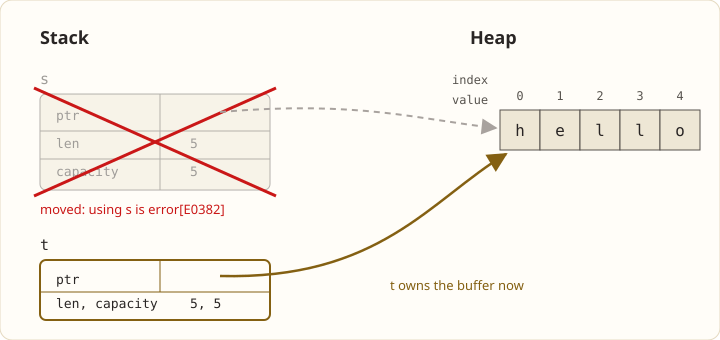

This blog is a public notebook for learning Rust: what I read, what I build, and every place the compiler disagreed with me.

## What to expect

- **Notes** on the parts of the language that took more than one read: ownership, borrowing, lifetimes, traits.
- **Exercises** worked through from start to finish, including the wrong turns.
- **Small projects** built along the way.

> [!NOTE]
> Posts are written while learning, not after. Expect corrections in later posts.

The plan starts with [The Rust Programming Language](https://doc.rust-lang.org/book/), the book most people learn from, whose introduction sets the tone:

> Rust is for people who crave speed and stability in a language.
>
> — [The Rust Programming Language](https://doc.rust-lang.org/book/ch00-00-introduction.html)

## The first program

Every journey starts with `cargo new`, which writes two files:

```rust group="hello" tab="src/main.rs"
fn main() {
    println!("Hello, world!");
}
```

```toml group="hello" tab="Cargo.toml"
[package]
name = "hello"
version = "0.1.0"
edition = "2024"
```

```sh
cargo run
```

And the first lesson the borrow checker teaches:

```rust {3-4}
fn main() {
    let s = String::from("hello");
    let t = s;
    println!("{s}");
}
```

```ansi frame="terminal" title="cargo build"
error[E0382]: borrow of moved value: `s`
 --> src/main.rs:4:16
  |
2 |     let s = String::from("hello");
  |         - move occurs because `s` has type `String`, which does not implement the `Copy` trait
3 |     let t = s;
  |             - value moved here
4 |     println!("{s}");
  |                ^^^ value borrowed here after move
```



Assigning `s` to `t` moves the [`String`](https://doc.rust-lang.org/std/string/struct.String.html): it doesn't implement the [`Copy`](https://doc.rust-lang.org/std/marker/trait.Copy.html) trait, so the [`println!`](https://doc.rust-lang.org/std/macro.println.html) that follows can't borrow it. Calling [`clone`](https://doc.rust-lang.org/std/clone/trait.Clone.html#tymethod.clone) first, or reaching for the [`std::rc`](https://doc.rust-lang.org/std/rc/index.html) module, are the next chapters.

| Concept   | First impression     |
| --------- | -------------------- |
| Ownership | Strict, then obvious |
| Borrowing | Mostly fine          |
| Lifetimes | Ask me later         |

Some posts will need a little math. A [`Vec`](https://doc.rust-lang.org/std/vec/struct.Vec.html) that doubles its capacity whenever it fills up copies fewer than $2n$ elements over $n$ pushes, which is why `push` is cheap on average:

$$
sum_(k=0)^(floor(log_2 n)) 2^k = 2^(floor(log_2 n) + 1) - 1 < 2n
$$
